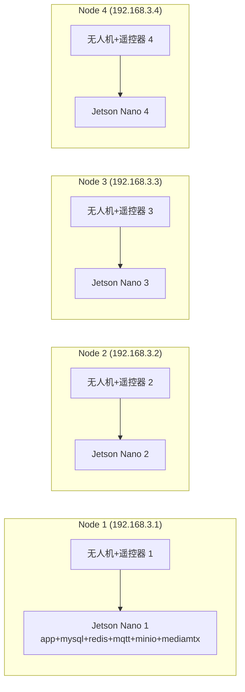

# 4 节点 Jetson Nano 部署手册（每台 Nano 独立一套云端服务）

## 0. 场景与结论

场景：4 架无人机 + 4 台遥控器，各自搭配 1 台 Jetson Nano 伴飞计算机，Nano 上跑一套完整的 Cloud-API 服务（app + MySQL + Redis + MQTT + MinIO + MediaMTX），4 台 Nano 全部在同一个局域网，固定 IP 分别为：

| 节点 | Nano 固定 IP |
|---|---|
| Node 1 | 192.168.3.1 |
| Node 2 | 192.168.3.2 |
| Node 3 | 192.168.3.3 |
| Node 4 | 192.168.3.4 |

**结论：你的思路是对的**——只需要构建 **一份** Docker 镜像，分发到 4 台 Nano，每台 Nano 用自己的 `.env` 文件区分配置（主要是固定 IP、各类密码密钥），不需要为每台 Nano 单独改代码或分别 build。

本次已经完成的配套改造（已提交到仓库，无需你再手动改代码）：

- `docker/config/application.yml`：所有需要按节点区分的配置项（数据库账号密码、Redis、MQTT 地址、对象存储地址/密钥、JWT 密钥、RTSP 鉴权）全部改成 `${VAR:默认值}` 占位符，由环境变量注入。
- `docker-compose.yml`（Mac/单机开发用）：新增对应环境变量，全部带默认值，**不建 `.env` 也和之前行为完全一致**。
- `docker-compose.nano.yml`（新增，Jetson Nano 专用）：使用 `network_mode: host`，避免桥接网络下 "容器互相用服务名还是用宿主机 IP" 的歧义，逻辑更简单可靠。
- `.env.example`（新增，根目录）：每台 Nano 部署时复制一份改成 `.env`。

> 踩坑记录：MQTT 相关配置在代码里被绑定成 `Map<MqttUseEnum, MqttClientOptions>`，如果直接用 `MQTT_HOST`/`MQTT_PORT` 作为**容器内**环境变量名，会被 Spring Boot 宽松绑定成 `mqtt.host`/`mqtt.port`，与这个 Map 绑定冲突导致应用直接启动失败。因此容器内实际用的变量名是 `BROKER_HOST`/`BROKER_PORT`/`BROKER_DRC_PORT`（`.env` 里你写 `MQTT_HOST` 等对外语义化的名字即可，compose 文件负责转换，不需要你关心这个细节，只是提醒不要自己再加 `MQTT_` 开头的容器环境变量）。

---

## 1. 部署架构



4 套服务完全独立、互不通信，唯一的公共点是同一个局域网网段。每台 Nano：

- HTTP/REST/WebSocket：`<本机IP>:9000`
- MQTT：`<本机IP>:1883`（DRC WebSocket：`9001`）
- MinIO（对象存储）：`<本机IP>:9100`（host 网络模式下显式让 MinIO 监听 9100，避免与应用的 9000 端口冲突）
- RTSP 拉流：`<本机IP>:8554`

对应的遥控器/Pilot App 只需要各自指向自己那台 Nano 的固定 IP，不会串。

---

## 2. 前置准备

### 2.1 每台 Jetson Nano

- JetPack / Ubuntu 已装好，能上外网（用于第一次拉取基础镜像 mysql/redis/mosquitto/minio/mediamtx；如果 Nano 完全无外网访问，见 §3.3 离线镜像方案）。
- 安装 Docker + docker compose 插件：

```bash
curl -fsSL https://get.docker.com | sh
sudo usermod -aG docker $USER   # 重新登录生效
sudo apt-get install -y docker-compose-plugin
docker compose version
```

### 2.2 固定每台 Nano 的局域网 IP

用 netplan（Ubuntu 常见方式）示例，Node 1 为例，网卡名以 `ip a` 实际结果为准：

```yaml
# /etc/netplan/01-netcfg.yaml
network:
  version: 2
  ethernets:
    eth0:
      dhcp4: no
      addresses: [192.168.3.1/24]
      routes:
        - to: default
          via: 192.168.3.254   # 按实际网关填写，没有网关可以不写 routes
      nameservers:
        addresses: [8.8.8.8, 114.114.114.114]
```

```bash
sudo netplan apply
ip a show eth0   # 确认已生效
```

Node 2/3/4 同理，只改 `addresses` 为 `.2`/`.3`/`.4`。

---

## 3. 镜像构建与分发

### 3.1 在开发机（Mac）上构建镜像

Jetson Nano 是 **ARM64（aarch64）**，Apple Silicon Mac 本机架构也是 arm64，本机直接 `docker build` 产出的镜像天然就是 arm64，**不需要 buildx 跨架构编译**（如果你用的是 Intel Mac 或将来在 x86 CI 上构建，才需要 `docker buildx build --platform linux/arm64`）。

```bash
cd /path/to/Cloud-API
docker build -t uav-cloud-api-app:1.10.0 .
```

确认一下架构（应显示 `arm64`）：

```bash
docker image inspect uav-cloud-api-app:1.10.0 --format '{{.Architecture}}'
```

### 3.2 分发方式：优先用私有镜像仓库；无外网就用 docker save/load

**方式 A（推荐，后续升级方便）：局域网私有 Registry**

在其中一台机器（Mac 或某台 Nano）上起一个最简单的私有仓库：

```bash
docker run -d -p 5000:5000 --restart unless-stopped --name registry registry:2
```

Mac 上打 tag 并推送（假设这台机器局域网 IP 是 192.168.3.199）：

```bash
docker tag uav-cloud-api-app:1.10.0 192.168.3.199:5000/uav-cloud-api-app:1.10.0
docker push 192.168.3.199:5000/uav-cloud-api-app:1.10.0
```

每台 Nano 上（先在 `/etc/docker/daemon.json` 里把 `192.168.3.199:5000` 加入 `insecure-registries`，因为是 HTTP 非 HTTPS）：

```json
{ "insecure-registries": ["192.168.3.199:5000"] }
```

```bash
sudo systemctl restart docker
docker pull 192.168.3.199:5000/uav-cloud-api-app:1.10.0
docker tag 192.168.3.199:5000/uav-cloud-api-app:1.10.0 uav-cloud-api-app:1.10.0
```

**方式 B（无网络/一次性场景）：docker save / load**

```bash
# Mac 上导出
docker save uav-cloud-api-app:1.10.0 | gzip > uav-cloud-api-app-1.10.0.tar.gz

# 拷贝到每台 Nano（4 次）
scp uav-cloud-api-app-1.10.0.tar.gz nano-user@192.168.3.1:/tmp/
scp uav-cloud-api-app-1.10.0.tar.gz nano-user@192.168.3.2:/tmp/
scp uav-cloud-api-app-1.10.0.tar.gz nano-user@192.168.3.3:/tmp/
scp uav-cloud-api-app-1.10.0.tar.gz nano-user@192.168.3.4:/tmp/

# 每台 Nano 上加载
gunzip -c /tmp/uav-cloud-api-app-1.10.0.tar.gz | docker load
```

之后升级只需要重复"构建 → 推送/拷贝 → 每台 Nano pull 或 load"，`.env` 不用动。

### 3.3 基础镜像（mysql/redis/mosquitto/minio/mediamtx）

如果 Nano 能连外网，`docker compose pull` 会自动从 Docker Hub 拉取，无需额外处理。如果完全离线，同样用 `docker save/load` 把这几个基础镜像也导出分发一遍（一次性操作，以后基本不用再动）。

---

## 4. 每台 Nano 的部署步骤

以 Node 1（192.168.3.1）为例，其余 3 台重复同样步骤，只改 `.env` 里的 `NODE_LAN_IP`。

### 4.1 拷贝部署所需文件

不需要拷贝整个仓库，只需要这几样：

```
docker-compose.nano.yml
.env.example
docker/config/application.yml
docker/mediamtx.yml
docker/mosquitto/mosquitto.conf
sql/cloud_api.sql
```

```bash
scp docker-compose.nano.yml .env.example nano-user@192.168.3.1:~/cloud-api/
scp -r docker sql nano-user@192.168.3.1:~/cloud-api/
```

### 4.2 生成本节点的 `.env`

所有变量都通过同目录下的 `.env` 文件配置，两个 compose 文件会自动读取它。链路是：`.env` → docker-compose 的 `environment:` → 容器内环境变量 → `application.yml` 里的 `${VAR:默认值}` 占位符在启动时解析。

**场景 1：Mac 本地单机开发（`docker-compose.yml`）—— 什么都不用配**

每个变量都写了 `:-默认值`，不建 `.env` 文件就是原来的行为（`mysql`/`redis`/`mqtt`/`minio` 这些 Docker 服务名，和之前一模一样）。继续用 `docker compose up -d` 就行，这一项不用改任何东西。

**场景 2：4 台 Jetson Nano 部署（`docker-compose.nano.yml`）—— 每台建一份 `.env`**

```bash
ssh nano-user@192.168.3.1
cd ~/cloud-api
cp .env.example .env
```

以 Node 1（192.168.3.1）为例，具体该填什么：

| 变量 | 该填的值 | 为什么 |
|---|---|---|
| `NODE_LAN_IP` | `192.168.3.1` | **必填**，决定 `BROKER_HOST`（MQTT 对外地址）和 `OSS_ENDPOINT`（`http://本机IP:9100`），这两个是自动从它派生的，不用单独配 |
| `DB_NAME` / `DB_USER` | 一般不用改，保持 `cloud_sample` / `uav_cloud` | 只是内部数据库名/账号，不对外暴露，4 台相同没问题 |
| `DB_PASSWORD` | 建议 4 台各设一个强密码，如 `Node1DbPass!` | 不对外暴露，但同网段其他设备理论上能扫到 3306 端口，改一下更安全 |
| `MYSQL_ROOT_PASSWORD` | 同上，建议改 | 同上 |
| `REDIS_PASSWORD` | 可留空（默认无密码） | 内网服务，风险较低，不改也行 |
| `OSS_ACCESS_KEY` / `OSS_SECRET_KEY` | 建议 4 台各设一个，如 `node1minio` / `Node1MinioPass!` | 会被用来生成文件下载 URL 里的签名，理论上能被外部设备看到，建议按节点区分 |
| `JWT_SECRET` | **每台必须不同**，用 `openssl rand -base64 32` 生成 | 签发/校验登录 token 的密钥，4 台若用同一个，理论上一台的 token 能在另一台冒用 |
| `RTSP_USERNAME` / `RTSP_PASSWORD` | 按需，不改也行（默认 admin/admin） | 只影响 RTSP 推流客户端鉴权 |
| `APP_IMAGE` | `uav-cloud-api-app:1.10.0`（4 台保持一致） | 4 台共用同一个镜像 tag，不用改 |

对应写入 `.env`：

```ini
NODE_LAN_IP=192.168.3.1
JWT_SECRET=<用 openssl rand -base64 32 生成一个独立值>
DB_PASSWORD=<强密码1>
MYSQL_ROOT_PASSWORD=<强密码1>
OSS_SECRET_KEY=<强密码1>
```

> 容易搞混的点：`.env` 里的变量名（`DB_HOST`、`MQTT_HOST` 等，给人看的语义化名字）和**容器内部实际生效的环境变量名**不完全一样——比如对外用 `MQTT_HOST`，但容器里最终注入的是 `BROKER_HOST`（见开头"踩坑记录"：避免被 Spring 宽松绑定到 `mqtt.*` 冲突）。这层转换已经在两个 compose 文件里写好了，只改 `.env` 本身就够，不需要关心这个转换细节。

### 4.3 启动

```bash
docker compose -f docker-compose.nano.yml --env-file .env up -d
docker compose -f docker-compose.nano.yml ps
```

首次启动 MySQL 会自动执行 `sql/cloud_api.sql` 建表+初始化数据（`manage_device` 是空表，无人机/遥控器/机巢通过 MQTT 连接时自动注册，不需要提前录入 SN）。

### 4.4 对其余 3 台重复

```bash
# Node 2
ssh nano-user@192.168.3.2
cd ~/cloud-api && cp .env.example .env
# 编辑 .env：NODE_LAN_IP=192.168.3.2，其余同上
docker compose -f docker-compose.nano.yml --env-file .env up -d

# Node 3 / Node 4 同理，IP 分别改成 .3 / .4
```

---

## 5. 验证清单

每台 Nano 各自独立验证，以 Node 1 为例：

```bash
# 1. 容器都健康
docker compose -f docker-compose.nano.yml ps

# 2. HTTP 接口可用
curl -s -o /dev/null -w "%{http_code}\n" http://192.168.3.1:9000/manage/api/v1/login

# 3. MQTT 端口对外可连（从另一台设备/电脑测试，不要在 Nano 本机测）
nc -zv 192.168.3.1 1883

# 4. MinIO API 健康检查
curl -I http://192.168.3.1:9100/minio/health/live

# 5. 登录接口返回的 mqtt_addr 应该是 tcp://192.168.3.1:1883，而不是 tcp://mqtt:1883
#    （用之前写好的 docs/python-demo/demo_01_login.py，把 config.py 里的 SERVER_IP 改成 192.168.3.1 后跑一遍即可看到）
```

关键点：**必须确认登录响应里的 `mqtt_addr` 字段是节点自己的局域网 IP**，而不是 `mqtt`/`localhost` 这种只在容器内部有效的地址——这是本次改造要解决的核心问题，如果验证时发现还是内部地址，说明 `.env` 里 `NODE_LAN_IP` 没填对或没生效，检查 `docker compose -f docker-compose.nano.yml exec app env | grep BROKER`。

Pilot App 侧配置：每台遥控器上的 Pilot App / 自定义 App，服务器地址都填自己那台 Nano 的固定 IP（`192.168.3.1` ~ `.4`），4 台互不干扰。

---

## 6. 安全与运维建议

- **JWT_SECRET、数据库密码、MinIO 密钥**：4 台节点务必使用不同的值，`.env` 不要提交到 git（已在 `.gitignore` 排除，只保留 `.env.example` 模板）。
- **MQTT 匿名访问**：`docker/mosquitto/mosquitto.conf` 当前是 `allow_anonymous true`，仅适合内网可信环境；如果这 4 台 Nano 所在网络还有其他不受控设备接入，建议改成用户名密码或证书认证。
- **workspace bind_code**：`sql/cloud_api.sql` 里默认的 bind_code 是 `qwe`，4 个节点各自独立数据库，用同一个 bind_code 不会冲突，但如果担心设备接错节点，可以给每个节点的 SQL 初始化脚本改一个不同的 bind_code（在 `manage_workspace` 表的 INSERT 语句里改）。
- **升级流程**：以后有新版本，只需要在 Mac 上重新 `docker build` 打同一个 tag（或递增版本号），用 §3.2 的方式重新分发到 4 台 Nano，`docker compose -f docker-compose.nano.yml up -d` 会自动重建 app 容器，其他服务（数据库等）数据不受影响。
- **备份**：每台 Nano 的 MySQL 数据卷（`mysql_data`）和 MinIO 数据卷（`minio_data`）建议定期备份，4 台节点数据互不共享，需要分别备份。
