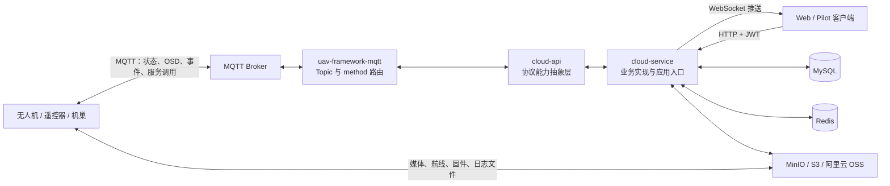
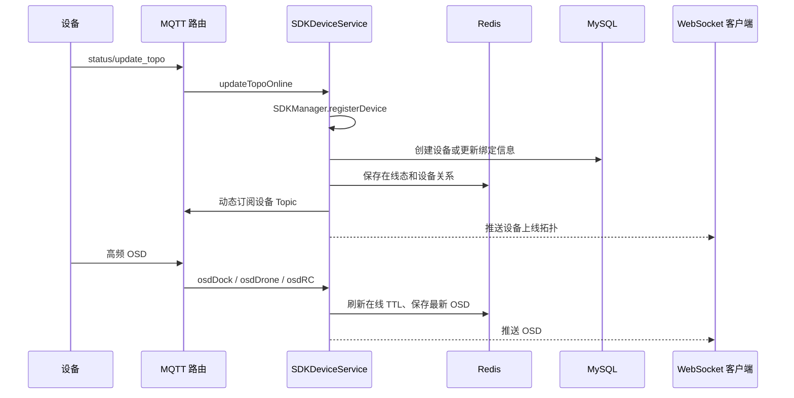

# Cloud API 项目快速理解指南

## 1. 项目介绍

这是一个面向无人机、遥控器和机巢的第三方云平台后端示例：它通过 MQTT 与设备双向通信，通过 HTTP 和 WebSocket 服务 Web/Pilot 客户端，并用 MySQL、Redis、对象存储保存业务数据和运行状态。

项目不是单纯的 REST CRUD 系统。它的核心是一个“协议适配 + 消息路由 + 业务状态编排”系统：

1. 设备通过 MQTT 上报在线状态、遥测、事件和资源请求。
2. SDK 框架按照 Topic 和消息 `method` 将消息路由到具体处理器。
3. 业务服务更新 MySQL/Redis，并通过 WebSocket 通知前端。
4. 前端发起控制、航线、直播等 HTTP 请求时，服务端再通过 MQTT 向设备下发指令并等待应答。

## 2. 总体架构



可以把整个系统分成四层：

| 层次 | 位置 | 作用 |
|---|---|---|
| 应用层 | `cloud-service` | Controller、业务服务、数据库实体、定时任务、SDK 回调实现 |
| SDK 接口层 | `cloud-api` | 定义设备能力的抽象服务及一部分设备侧 HTTP 接口 |
| 基础框架层 | `uav-framework/*` | MQTT、WebSocket、JWT/Web、Redis、MyBatis Plus、对象存储 |
| 外部基础设施 | MySQL、Redis、MQTT Broker、OSS | 持久化、在线态、消息总线和文件存储 |

## 3. 仓库结构

```text
.
├── cloud-service/                    # 可运行的 Spring Boot 业务服务
│   └── src/main/java/com/uav/service
│       ├── manage/                   # 用户、工作空间、设备、拓扑、HMS、日志、固件、直播
│       ├── wayline/                  # 航线文件、飞行任务、任务进度与调度
│       ├── control/                  # 机巢控制、飞行/负载控制、DRC
│       ├── media/                    # 媒体回调、去重、查询
│       ├── map/                      # 地图元素、飞行区域和禁限飞区
│       ├── storage/                  # STS/对象存储凭证
│       └── assignment/               # 启动恢复和全局定时任务
├── cloud-api/                        # Cloud API 能力抽象和协议入口
├── uav-framework/                  # 7 个可独立安装的基础框架模块
│   ├── uav-framework-context/      # 公共模型、异常、JWT、Web 拦截器
│   ├── uav-framework-mqtt/         # MQTT 模型、路由、订阅、同步请求应答
│   ├── uav-framework-websocket/    # WebSocket 鉴权、会话和推送
│   ├── uav-framework-redis/        # Redis 工具与 key 约定
│   ├── uav-framework-db/           # MyBatis Plus、Druid、审计字段填充
│   ├── uav-framework-storage/      # MinIO、S3、阿里云 OSS 适配
│   └── uav-framework-web/          # Web 自动装配
├── sql/cloud_api.sql                 # 建库、建表和演示初始化数据
├── pom.xml                           # cloud-service + cloud-api 聚合工程
└── uav-framework/pom.xml           # 基础框架的独立聚合工程
```

当前约有 885 个 Java 文件，其中大量文件是 MQTT 协议 DTO 和枚举。真正的业务阅读重点是 `cloud-service` 的约 296 个文件，而不是逐个阅读全部协议模型。

### 两个 Maven 聚合工程

仓库实际上存在两个相互独立的 Maven Reactor：

- 根 `pom.xml` 只聚合 `cloud-service` 与 `cloud-api`。
- `uav-framework/pom.xml` 单独聚合 7 个 framework 模块。

`cloud-service` 和 `cloud-api` 通过 Maven 坐标依赖 framework，因此首次本地构建时通常要先安装 framework，再构建根工程。

## 4. 启动入口与自动装配

应用入口是：

```text
cloud-service/src/main/java/com/uav/service/ServiceCloudApiApplication.java
```

关键注解：

- `@SpringBootApplication`：启动 Spring Boot。
- `@ComponentScan("com.uav")`：扫描业务、SDK 和 framework 中的组件。
- `@MapperScan("com.uav.service.*.dao")`：注册 MyBatis Mapper。
- `@EnableScheduling`：启用设备离线检测和航线任务调度。

各 framework 通过 `META-INF/spring/...AutoConfiguration.imports` 自动加载。`cloud-api` 的 `InitializationAutoConfiguration` 会扫描 `com.uav.api`，使抽象 SDK 服务和消息入口进入 Spring 容器。

启动后，`ApplicationBootInitial` 会读取 Redis 中已有的在线设备，重新注册到 `SDKManager` 并恢复动态 MQTT 订阅。这意味着 Redis 不只是普通缓存，也承担了部分“进程重启后恢复运行态”的职责。

## 5. 最关键的消息机制

### 5.1 MQTT Topic 一级路由

`MqttConfiguration` 建立 MQTT 入站和出站适配器。初始订阅由 `cloud-sdk.mqtt.inbound-topic` 配置，当前默认包含：

```text
sys/product/+/status
thing/product/+/requests
thing/product/+/state
```

收到原始消息后，`InboundMessageRouter` 根据 Topic 正则将消息分到不同通道：

| Topic 类型 | 含义 | 目标通道 |
|---|---|---|
| `status` | 设备上线、下线与拓扑 | `INBOUND_STATUS` |
| `state` | 设备属性状态变化 | `INBOUND_STATE` |
| `osd` | 高频遥测数据 | `INBOUND_OSD` |
| `events` | 异步事件和进度 | `INBOUND_EVENTS` |
| `requests` | 设备主动向云端请求资源 | `INBOUND_REQUESTS` |
| `services_reply` | 云端服务调用的设备应答 | `INBOUND_SERVICES_REPLY` |
| `property/set_reply` | 属性设置应答 | `INBOUND_PROPERTY_SET_REPLY` |
| `drc/up` | DRC 上行数据 | `INBOUND_DRC_UP` |

Topic 规则集中在：

```text
uav-framework/uav-framework-mqtt/src/main/java/com/uav/great/mqtt/enums/base/CloudApiTopicEnum.java
```

### 5.2 `method` 二级路由

进入 `events`、`requests`、`state` 等通道后，对应 Router 会：

1. 将 JSON 转为通用 Topic Request。
2. 从 Topic 提取发送设备 SN，写入 `from`/`gateway`。
3. 根据消息中的 `method` 查找枚举。
4. 将 `data` 转换成该 method 对应的强类型 DTO。
5. 路由到具体 Spring Integration Channel。
6. 由 `@ServiceActivator` 标记的方法消费。

例如 `flighttask_progress` 会最终进入 `AbstractWaylineService.flighttaskProgress(...)`，实际运行时由 `SDKWaylineService` 或 `FlightTaskServiceImpl` 的覆写方法处理。

### 5.3 云端向设备发命令

向设备下发命令主要经过：

```text
业务 Service
  -> cloud-api Abstract*Service
  -> MqttGatewayPublish
  -> IMqttMessageGateway
  -> MQTT Broker
  -> 设备
```

同步调用通过 `tid`/`bid` 关联请求与应答。`MqttGatewayPublish.publishWithReply(...)` 使用内存中的 `Chan` 等待回复，默认超时 3 秒并重试 2 次；超时会抛出 `CloudSDKException`。因此一个看似普通的 HTTP 控制接口，内部通常包含一次同步 MQTT 往返。

### 5.4 动态订阅

服务启动时只订阅少量通配 Topic。设备上线后，`SDKDeviceService.updateTopoOnline(...)` 会：

1. 注册网关与子设备到进程内 `SDKManager`。
2. 将在线信息写入 Redis，并补充/更新 MySQL 设备记录。
3. 根据设备能力动态订阅 status、state、osd、services、events、requests、property 等 Topic。
4. 向当前 workspace 的前端推送最新拓扑。

设备离线后会取消动态订阅，并从 Redis 和 `SDKManager` 清理运行状态。

## 6. 四条核心业务链路

### 6.1 设备上线、遥测与前端展示



`GlobalScheduleService` 每 30 秒扫描 Redis 在线 key。剩余 TTL 小于等于 30 秒的设备会被判定为离线，然后执行取消订阅与前端通知。

### 6.2 HTTP 控制设备

典型入口位于 `control/controller/DockController`：

```text
POST control/api/v1/devices/{sn}/jobs/{service_identifier}
POST control/api/v1/devices/{sn}/jobs/fly-to-point
POST control/api/v1/devices/{sn}/jobs/takeoff-to-point
POST control/api/v1/devices/{sn}/authority/flight
POST control/api/v1/devices/{sn}/authority/payload
POST control/api/v1/devices/{sn}/payload/commands
```

流程通常是：JWT 鉴权 → 校验设备在线与控制权 → 根据命令枚举找到处理器 → 通过 SDK 向设备发布 MQTT 服务调用 → 等待 reply → 将统一 `HttpResultResponse` 返回前端。异步进度则由设备后续通过 events 上报，再经 WebSocket 推送。

`control/service/impl` 中的 `CameraAimImpl`、`GimbalResetImpl`、`CameraPhotoTakeImpl` 等类体现了“一个命令一个处理器”的策略式组织方式。

### 6.3 航线任务

航线业务涉及 MySQL、Redis、OSS、MQTT 和 WebSocket，是理解整个系统最有代表性的模块：

1. 前端上传 KMZ 航线文件到对象存储，回调后写入 `wayline_file`。
2. 创建任务时写入 `wayline_job`。
3. 立即任务直接准备并下发；定时任务放入 Redis ZSet；条件任务在 Redis 保存执行条件。
4. `FlightTaskServiceImpl` 每 5 秒检查定时/条件任务。
5. 设备收到任务后，会通过 `flighttask_resource_get` 向云端请求航线文件的临时 URL。
6. 设备通过 `flighttask_progress` 持续上报进度。
7. `SDKWaylineService` 更新任务状态、记录媒体数量，并通过 WebSocket 推送进度。
8. 任务结束后的媒体文件上传进度由 media 模块继续跟踪。

任务大致有三类：立即、定时、条件。运行中、暂停、待准备任务都依赖 Redis；任务定义和最终状态保存在 MySQL。

### 6.4 媒体与对象存储

文件内容不经过应用服务器中转，主体流程是“云端提供临时凭证/预签名 URL，设备或前端直传 OSS，上传完成后回调业务服务”。

- `StorageServiceImpl` 返回 MinIO/S3/阿里云 OSS 的凭证和 bucket 信息。
- `MediaServiceImpl` 处理快速上传去重、上传回调、媒体元数据入库。
- `FileServiceImpl` 负责 `media_file` CRUD 与下载 URL。
- Redis 保存某次航线任务的应上传数量、已上传数量和最高优先级任务。
- 上传进度通过 WebSocket 通知 Web 端。

固件、设备日志、飞行区域文件、航线文件也使用同一套对象存储抽象。

## 7. 业务模块地图

| 模块 | 主要职责 | 核心入口/实现 |
|---|---|---|
| manage/device | 设备上线、绑定、拓扑、OSD、属性、OTA | `SDKDeviceService`、`DeviceServiceImpl`、`DeviceController` |
| manage/user | 登录、JWT、用户和 workspace | `LoginController`、`UserServiceImpl` |
| manage/livestream | 直播能力、开始/停止、清晰度、镜头 | `LiveStreamController`、`LiveStreamServiceImpl` |
| manage/hms | 设备健康告警保存与推送 | `DeviceHmsServiceImpl` |
| manage/log | 设备日志列表、上传任务与回调 | `DeviceLogsServiceImpl` |
| manage/firmware | 固件文件、版本、OTA 进度 | `DeviceFirmwareServiceImpl`、`SDKDeviceService` |
| wayline | 航线文件、任务调度与进度 | `FlightTaskServiceImpl`、`SDKWaylineService` |
| control | 设备、相机、云台、负载和 DRC 控制 | `ControlServiceImpl`、`SDKControlService`、`DrcServiceImpl` |
| media | 媒体文件去重、回调、查询 | `MediaServiceImpl`、`FileServiceImpl` |
| map | 地图元素、分组、飞行区域同步 | `WorkspaceElementServiceImpl`、`FlightAreaServiceImpl` |
| storage | 临时对象存储凭证 | `StorageServiceImpl` |

## 8. HTTP、鉴权和 WebSocket

### HTTP 路径

应用默认监听 `9000`，REST API 按业务域分组：

| 前缀 | 业务域 |
|---|---|
| `/manage/api/v1` | 登录、用户、工作空间、设备、直播、固件、HMS、日志 |
| `/map/api/v1` | 地图和飞行区域 |
| `/media/api/v1` | 媒体文件 |
| `/wayline/api/v1` | 航线和任务 |
| `/storage/api/v1` | 对象存储凭证 |
| `/control/api/v1` | 设备控制与 DRC |

Controller 返回值统一使用 `HttpResultResponse`，分页使用 `PaginationData`。

### JWT 鉴权

- 登录：`POST /manage/api/v1/login`。
- Token 请求头：`x-auth-token`。
- JWT claim 包含用户 ID、用户名、用户类型和 workspace ID。
- 除登录、刷新 token、Swagger/UI 和 test 路径外，所有 HTTP 请求都经过 `AuthInterceptor`。

### WebSocket

- 端点：`/api/v1/ws?x-auth-token=<JWT>`。
- 握手时解析 JWT。
- 会话 Principal 格式：`{workspaceId}/{userType}/{userId}`。
- 服务端可按 workspace、用户类型或用户定向广播。
- 推送消息使用 `WebSocketMessageResponse`，通过 `BizCodeEnum` 区分设备拓扑、OSD、任务进度、媒体进度等业务事件。

WebSocket 在本项目中主要用于服务端推送，而不是承载核心控制命令。

## 9. 数据存储与主要表

SQL 脚本共定义 17 张表，未显式创建外键，关联关系主要由业务代码和 UUID/SN 字段维护。

| 数据域 | 表 | 说明 |
|---|---|---|
| 租户与账号 | `manage_workspace`、`manage_user` | workspace 是主要数据隔离维度 |
| 设备 | `manage_device`、`manage_device_dictionary`、`manage_device_payload` | 设备、产品字典、负载关系 |
| 固件与健康 | `manage_device_firmware`、`manage_firmware_model`、`manage_device_hms` | 固件包、适配机型、HMS 告警 |
| 日志 | `manage_device_logs`、`logs_file`、`logs_file_index` | 日志上传任务及文件 |
| 航线与媒体 | `wayline_file`、`wayline_job`、`media_file` | 航线定义、执行任务、媒体元数据 |
| 地图/飞行区域 | `map_group`、`map_group_element`、`map_element_coordinate`、`flight_area_property`、`flight_area_file`、`device_flight_area` | 地图元素和设备同步状态 |

### MySQL 与 Redis 的边界

- MySQL：长期业务数据、可查询历史、最终任务状态。
- Redis：在线设备、最新 OSD、短期流程状态、航线调度队列、媒体上传计数、DRC 状态。
- `SDKManager`：当前 JVM 内的设备协议能力与 Topic 信息；进程重启后由 Redis 恢复。

Redis key 应优先从 `uav-framework-redis/.../RedisConst.java` 查找，避免自行拼接造成不兼容。

## 10. 本地启动

### 10.1 前置条件

- JDK 17（项目明确以 Java 17 编译；不要直接使用过新的 JDK）
- Maven 3.8+
- MySQL 8
- Redis
- MQTT Broker（配置结构和账号字段偏向 EMQX）
- MinIO、Amazon S3 或阿里云 OSS 三选一

### 10.2 初始化数据库

执行：

```bash
mysql -u <user> -p < sql/cloud_api.sql
```

然后修改 `cloud-service/src/main/resources/application.yml` 中的 datasource。

注意：SQL 脚本创建的是 `cloud_sample`，当前 YAML 示例连接的却是 `cloud_service`。两者必须改成一致。

### 10.3 配置外部服务

至少需要填写：

- `spring.datasource.druid.*`
- `spring.redis.*`
- `mqtt.BASIC.*`
- `oss.*`
- `cloud-api.app.*`

如果使用 DRC，再配置 `mqtt.DRC.*`；如果使用直播，再配置相应的 RTMP/RTSP/GB28181/WHIP/Agora 参数。

建议通过环境变量或单独的 profile 文件注入密钥，不要提交真实凭证。

### 10.4 构建与运行

```bash
# 1. 安装本仓库内的 framework artifacts
mvn -f uav-framework/pom.xml clean install

# 2. 构建 SDK 与应用
mvn clean package

# 3. 启动
java -jar cloud-service/target/cloud-service-1.10.0.jar
```

也可以在完成 framework 安装和根工程构建后，进入应用模块运行：

```bash
mvn -f cloud-service/pom.xml spring-boot:run
```

### 10.5 最小验证

1. 日志中没有 MySQL、Redis、MQTT 或 OSS 连接失败。
2. `POST /manage/api/v1/login` 能返回 access token。
3. 使用 `x-auth-token` 请求 `/manage/api/v1/workspaces/current`。
4. 使用 token 连接 `/api/v1/ws`。
5. 设备接入后，Redis 出现在线 key，前端收到拓扑与 OSD 推送。

SQL 中包含演示账号，但它们是明文弱口令，只适合本地演示，不应在共享或生产环境使用。

## 11. 启动前必看的问题与风险

### 配置与版本不一致

1. SQL 数据库名是 `cloud_sample`，YAML 是 `cloud_service`。
2. 应用默认端口和示例 MinIO endpoint 都是本机 `9000`；若 MinIO 与应用在同一台主机，会端口冲突。
3. 根 README 写的发布版是 1.0.0，根 POM 当前版本是 1.10.0，`cloud-api` 版本是 1.0.3。
4. 日志级别仍配置为 `com.dji`，而本项目包名是 `com.uav`，该 debug 配置基本不会覆盖业务代码。

### 安全风险

1. 示例 JWT secret 固定且过弱。
2. SQL 中用户密码明文存储，登录逻辑也是直接字符串比较。
3. YAML 中存在示例 MQTT/DRC 账号字段；部署前必须全部替换并从仓库配置中移除。
4. WebSocket 允许任意 Origin，依赖 token 保证身份；生产环境应限制可信 Origin。
5. 这是示例工程，workspace 数据权限校验应在生产化前做一次完整审计，不能只依赖前端传入的 `workspace_id`。

### 可靠性与维护性

1. 部分同步 MQTT 应答依赖 JVM 内存 `Chan`；多实例部署时必须确认请求和 reply 能落到同一实例，或改造成共享关联机制。
2. 在线态和任务调度强依赖 Redis，Redis 数据清理或不可用会影响设备状态与任务恢复。
3. 数据库没有外键，需要应用保证 workspace、设备、任务、文件间的一致性。
4. 当前仓库没有常规单元测试/集成测试目录，协议与流程修改需要搭建 MQTT/Redis/MySQL 集成测试。
5. 多个定时任务默认允许每个实例执行；多实例部署前应增加分布式锁或明确分片策略。

### 已验证的构建现象

在 JDK 25 下离线构建 framework 时，Lombok 生成的 `log` 字段未正常生成并导致编译失败。项目 POM 明确指定 Java 17，因此应首先切换到 JDK 17 再判断是否存在真实代码问题。

## 12. 推荐阅读顺序

不要按目录逐文件阅读。按下面顺序可以最快形成闭环：

1. `cloud-service/src/main/resources/application.yml`：先知道外部依赖和业务前缀。
2. `ServiceCloudApiApplication`：确认扫描、Mapper 和定时任务。
3. `CloudApiTopicEnum` + `InboundMessageRouter`：理解 MQTT 一级路由。
4. `EventsRouter`、`StateRouter`、`ServicesReplyHandler`：理解 method 二级路由与应答。
5. `AbstractDeviceService` + `SDKDeviceService`：理解上线、OSD、状态变化。
6. `DeviceServiceImpl`：理解动态订阅、Redis/MySQL/WebSocket 的结合。
7. `FlightTaskServiceImpl` + `SDKWaylineService`：理解完整复杂业务编排。
8. `ControlServiceImpl` + `SDKControlService`：理解 HTTP 到 MQTT 下发。
9. `MediaServiceImpl` + `StorageServiceImpl`：理解文件直传和回调。
10. `sql/cloud_api.sql` + 各 Entity/Mapper：最后补齐数据模型。

## 13. 如何新增一种设备能力

如果增加一种新的 Cloud API `method`，通常按以下路径修改：

1. 在 MQTT framework 中增加请求/响应 DTO。
2. 将 method 注册到对应的 `*MethodEnum`，绑定强类型 DTO 与 channel。
3. 在 `cloud-api` 对应 `Abstract*Service` 中增加 `@ServiceActivator` 入口或下发方法。
4. 在 `cloud-service` 创建/修改 SDK 实现类，覆写回调并编排数据库、Redis、WebSocket。
5. 如需开放给前端，再增加 Controller 和业务 Service。
6. 补充错误码、幂等处理、超时策略和设备版本兼容判断。
7. 用真实或模拟 MQTT 消息验证 Topic、method、`tid`、`bid` 和 reply Topic。

判断代码应该放在哪一层的简单原则：

- 协议通用能力放 `uav-framework-mqtt`。
- 面向 Cloud API 使用者的能力抽象放 `cloud-api`。
- 当前平台特有的持久化、权限和业务规则放 `cloud-service`。

## 14. 关键术语

| 术语 | 含义 |
|---|---|
| Gateway | 与云端直接通信的网关设备，通常是遥控器或机巢 |
| Sub-device | 由 Gateway 管理的无人机等子设备 |
| SN | 设备序列号，也是 Topic 和设备关联的核心标识 |
| Workspace | 租户/项目空间，用户与业务数据的主要隔离单位 |
| OSD | 高频设备遥测，如位置、姿态、电量、速度和机巢状态 |
| HMS | 健康管理/告警消息 |
| DRC | 低时延远程控制通道 |
| Wayline | 航线文件及其飞行任务 |
| `tid` | 一次消息交互的事务标识，用于匹配请求和应答 |
| `bid` | 一次业务流程标识，例如航线任务 ID |
| Thing version | 设备物模型/协议版本，影响可用能力和 Topic |

## 15. 最终心智模型

阅读任何功能时，都可以用下面六个问题定位：

1. 入口来自 HTTP，还是某个 MQTT Topic？
2. MQTT 消息属于 status/state/osd/events/requests/services 中哪一类？
3. `method` 在哪个枚举中注册，最终进入哪个 `Abstract*Service`？
4. `cloud-service` 中哪个实现类覆写了它？
5. 数据最终落在 MySQL、Redis、OSS 还是仅存在 JVM 内存？
6. 结果是同步 reply，还是后续通过 events/WebSocket 异步通知？

只要能回答这六个问题，就能快速理解并修改项目中的绝大多数功能。
